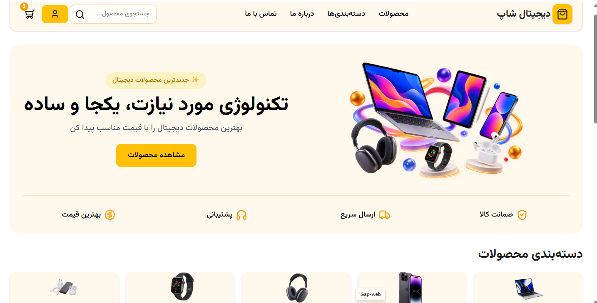

# 🛒 Digital Store

A modern responsive e-commerce website built with React and Tailwind CSS.



## 📌 About Project

Digital Store is a frontend e-commerce project that simulates an online shopping experience.

Users can:

- Browse products
- View product details
- Add products to shopping cart
- Save favorite products
- Create an account
- Login and manage profile information

This project was developed to practice modern frontend development concepts using React.

---

## ✨ Features

- ✅ Responsive design for different screen sizes
- ✅ Product listing page
- ✅ Product details page
- ✅ Shopping cart management
- ✅ Favorite products system
- ✅ Login and Register pages
- ✅ User profile page
- ✅ Data persistence using LocalStorage

---

## 🛠 Technologies

- React
- React Router
- Tailwind CSS
- JavaScript (ES6+)
- Lucide React Icons
- LocalStorage
- Vite

---

## 📂 Project Structure


---

## ⚙️ Installation

Clone the repository:

```bash
git clone https://github.com/miladfarghiary2813mdfymm-cloud/digital-store.git